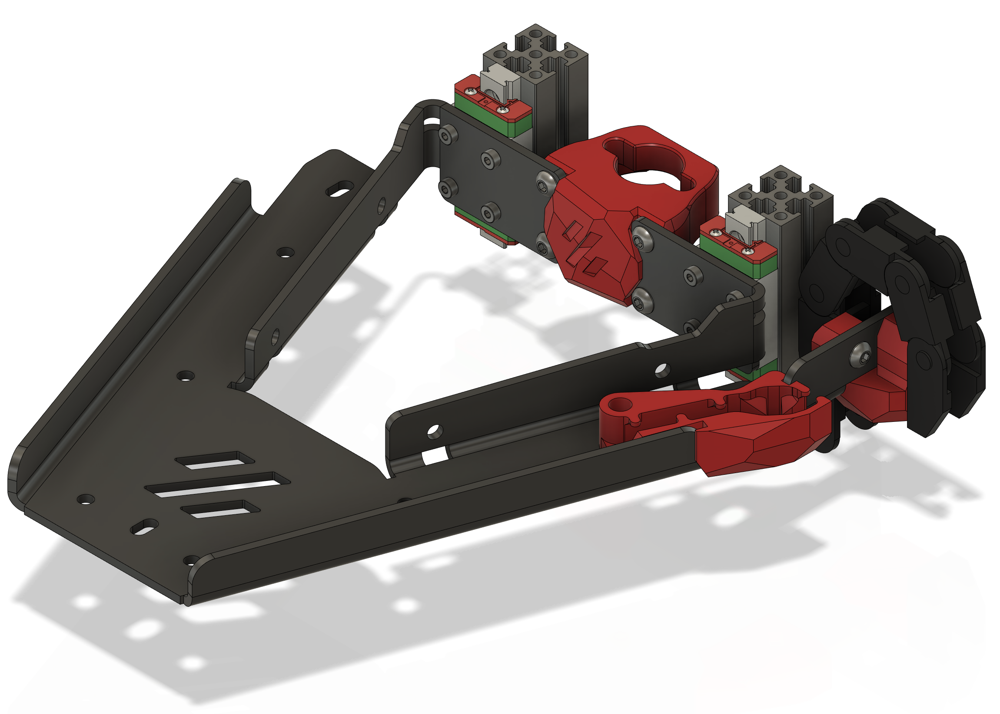

# What is this?

A laser cut and bent single piece bed concept, trying to implement a lightweight and stiff bed with full access to the mounting screws.

# Where can I get it? 

I only did a small prototype run and will not be able to sell it myself, however there are a few Voron related shops that started stocking it:

- [Deepfriedhero](https://dfh.fm/products/kirigami-beds?variant=43382871556318) (US) 
- [Fabreeko](https://www.fabreeko.com/products/voron-v0-1-kirigami-bed-kit-by-ldo?_pos=1&_sid=dece420eb&_ss=r&variant=43178853531903) (US)
- [3dmakerparts](https://3dmakerparts.com/products/voron-0-1-kirigami-bed) (US)
- [Printyplease](https://www.printyplease.uk/LDOKiri) (UK)
- [Lecktor](https://lecktor.com/en/v0-buildplate/905-kirigami-bed.html) (EU)
- [Fermio Labs](https://fermio.xyz/fermio-labs-gmbh/voron0-v0.1-kirigami/) (EU)
- [Unique Prints](https://uniqueprints.shop/shop/buildplate/kirigami-bed-upgrade-for-voron-v0-1/) (AU)

I will add additional suppliers _with a vendor role on the Voron discord_ - please contact me on discord or create a pull request with your discord ID.

# Which plastic parts do I need to print?
 

# License

The sheet metal part is available under [CC-BY-SA 4.0](https://creativecommons.org/licenses/by-sa/4.0/) AND [GPL V3.0](https://www.gnu.org/licenses/gpl-3.0.de.html). The plastic parts are partially derived from the existing Voron parts and hence follow the same License, [GPL V3.0](https://www.gnu.org/licenses/gpl-3.0.de.html). 

This means you are allowed to modify and share the sheet metal part under either license, as long as you credit me with a link to this Github repository. You are allowed to produce and sell the part without royalties, a donation on [vorondesign.com](https://vorondesign.com) to fund future development of the Voron project is however appreciated.

# Kiriwhat?

<https://en.wikipedia.org/wiki/Kirigami>

# BOM
- 1x Kirigami Bed
- 8x M2x4 to mount the bed to the carriages
- 4x M3 Heatsets + 4x M3x6 screws for the leadscrew mount
- 4x M3 Heatsets + 2 M3x6 screws for the chain mount
- 1x M3 Heatset + 1 M3x6 screw for the wire guide

# Mounting

# Versions
- V2: added a cutout for the thermal fuse
- V3: slots instead of holes for the bed springs, allowing to adjust the Y offset over a 3mm range to support V0.0 as well as the sherpa mini mod. 

# Installation
The guys from Maple Leaf Makers made a nice tutorial on how to convert the stock bed to Kirigami.

