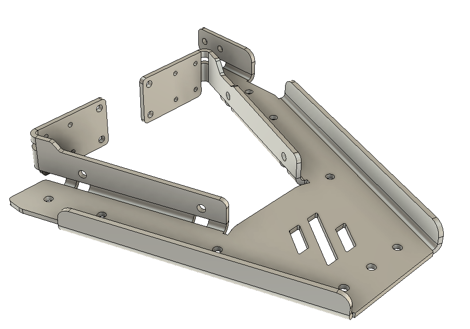

# What is this?

A laser cut and bent single piece bed concept, trying to implement a lightweight and stiff bed with full access to the mounting screws similar to the flatbed concept, but ditching the printed plastic parts

# Isnt't this expensive?

Lasercutting is surprisingly cheap - I got offers for manufacturing in small series for prices similar to the cast and machined bed which is mounted on top. Note that additional surface treatment steps will add to the cost.

# Where can I get it? 

I only did a small prototype run and will not be able to sell it myself, however there are a few Voron related shops that started stocking it:

- (Deepfriedhero)[https://deepfriedhero.in/products/voron-v0-1-kirigami-bed-by-christoph-muller] (US)
- (Fabreeko)[https://www.fabreeko.com/products/voron-v0-1-kirigami-bed-by-whoppingpochard] (US)

I will add additional suppliers with a channel on the Voron discord as the bed becomes available - please contact me on discord or create a pull request.

# Kiriwhat?

<https://en.wikipedia.org/wiki/Kirigami>

# BOM
- 1x Kirigami Bed
- 8x M2x4 to mount the bed to the carriages
- 4x M3 Heatsets + 4x M3 screws for the leadscrew mount
- 4x M3 Heatsets + M3 screws for the igus chain mount
- 2x M3 Heatsets + M3 screws for the belt chain mount

# Mounting

